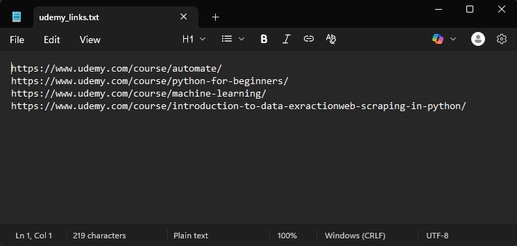
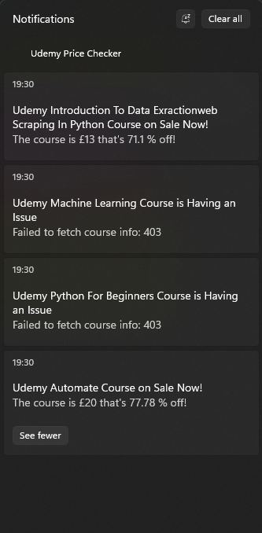

# Udemy Price Checker 🛒

A Python script that checks if any Udemy courses you want are on sale and sends a Windows notification when it is.

---

## 💡 What it does

- Checks Udemy every 15 minutes to see if any of the courses are on sale
- Sends a Windows notification if:
  - The course is on sale
  - There’s a problem fetching the course
- The notification includes the discounted price, percentage off, and stays visible in your Windows Action Center until dismissed
- Stops running for a course after a notification comes through so you don't get spammed but continues checking on any remaining courses (not on sale or not producing a URL error)

---

## ⚙️ How to Install and Use

### Install

1. Clone this repo:
   ```bash
   git clone https://github.com/mccool41/udemy_price_checker.git
2. Install Requirements:
   ```bash
   pip install requests
3. (Optional) Add to Windows Task Scheduler
    - Open Windows Task Scheduler (Press Win + R → type taskschd.msc → Enter)
    - Create a new task:
    - General tab:
        - Name: Udemy Price Checker
    - Triggers tab:
        - New → Begin the task: "At log on"
        - (Optional) Check specific user and choose your own
    - Actions tab:
        - New → Action: "Start a program"
        - Program/script: browse to where you saved "launch_silent.vbs"
    - Save the task.
    - Logging out and back in will be required unless you run the task manually the first time, you can do this by:
        - You can run this manually the first time by clicking on Task Scheduler Library on the left hand menu
        - Find and right click on your new task and select Run

### Use

1. Edit the udemy_links.txt to include all the Udemy course links you want to keep track of, one link per line
<p align="center">
  
</p>

2. That should be it, if you do want to run it manually without adding to the Windows Task Scheduler (skipping option 3 of the install above) then you can and everything should work until you close the process, sign out or it finds a sale (or URL error) for each course you added for it to check 🤞

---

## 🔐 Notes
🔇 Selecting "launch_silent.vbs" instead of the "run_price_checker.bat" in the Windows Task Scheduler suppresses the Command Prompt popup why the Python script is running.

Notifications use PowerShell to call Windows native toast system.

This does need all files in the same folder when used to function correctly

---

## ✅ Example Notification
**Title:**
Udemy Automate Course on Sale Now!

**Message:**
The course is £20 — that's 78.95% off!

